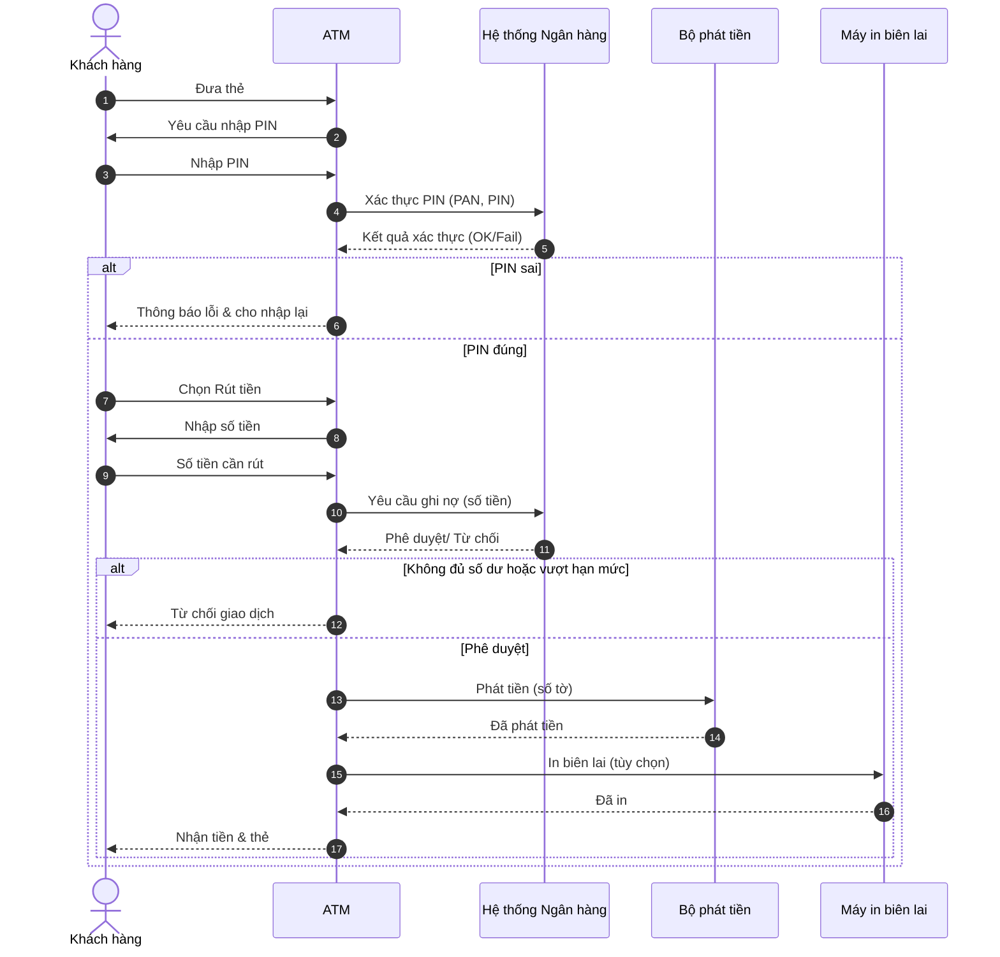

# ATM – Sequence Diagram: Rút tiền

```mermaid
sequenceDiagram
    autonumber
    actor KhachHang as Khách hàng
    participant ATM as ATM
    participant Core as Hệ thống Ngân hàng
    participant Dispenser as Bộ phát tiền
    participant Printer as Máy in biên lai

    KhachHang->>ATM: Đưa thẻ
    ATM->>KhachHang: Yêu cầu nhập PIN
    KhachHang->>ATM: Nhập PIN
    ATM->>Core: Xác thực PIN (PAN, PIN)
    Core-->>ATM: Kết quả xác thực (OK/Fail)

    alt PIN sai
        ATM-->>KhachHang: Thông báo lỗi & cho nhập lại
    else PIN đúng
        KhachHang->>ATM: Chọn Rút tiền
        ATM->>KhachHang: Nhập số tiền
        KhachHang->>ATM: Số tiền cần rút
        ATM->>Core: Yêu cầu ghi nợ (số tiền)
        Core-->>ATM: Phê duyệt/ Từ chối

        alt Không đủ số dư hoặc vượt hạn mức
            ATM-->>KhachHang: Từ chối giao dịch
        else Phê duyệt
            ATM->>Dispenser: Phát tiền (số tờ)
            Dispenser-->>ATM: Đã phát tiền
            ATM->>Printer: In biên lai (tùy chọn)
            Printer-->>ATM: Đã in
            ATM-->>KhachHang: Nhận tiền & thẻ
        end
    end
```
